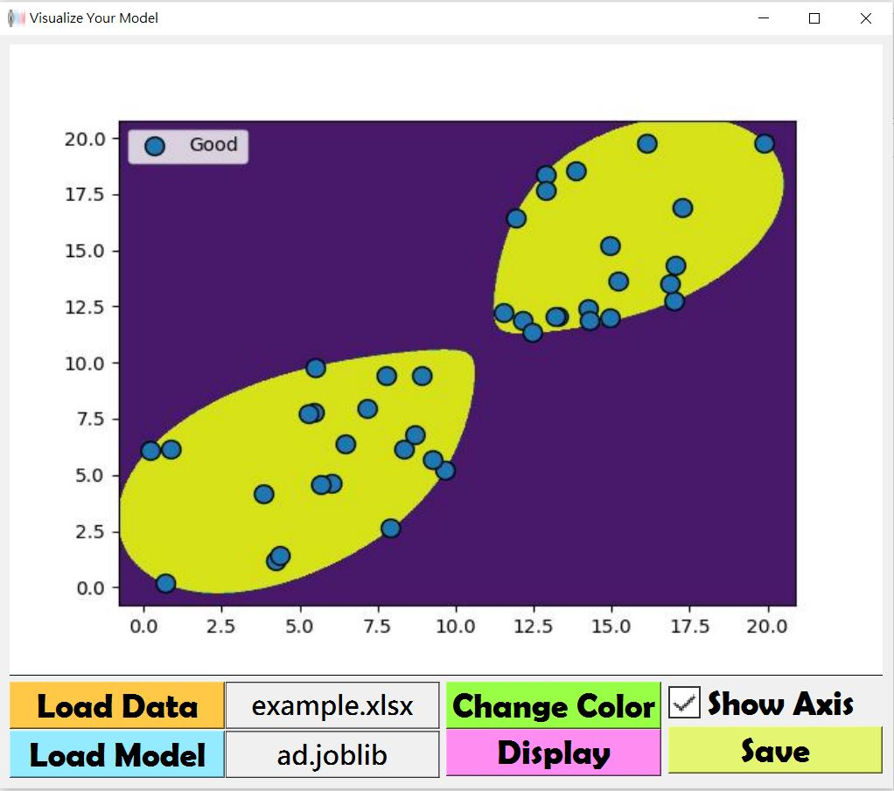

# Overview
Realize what your model have learned.

# Note
- Support scikit-learn classifier.
- Support 2D data.

# Prepare 
- __Excel File with 3 columns__ (*.csv or *.xlsx)  
  first is x coordinate, second is y coordinate, third is class name. 
- __Scikit-learn classifier__ (*.pickle or *.joblib)
  
# Usage
1. Load Data & model.
2. Click button `Display`.
3. (optional) Click button `Change Color` to choose the color style you prefer.
4. (optional) Check the box to make the plot show axis.
5. Click `Save` to save the plot.  

# About Download
Because the `app.exe` is stored in the git LFS, if you directly download the zip file, there will no `app.exe` in it. So you need to do the procedure below.

1. Click the `app.exe` in my github.
2. Press the tool button on the upper-right corner.
3. Click the button `Download`.
